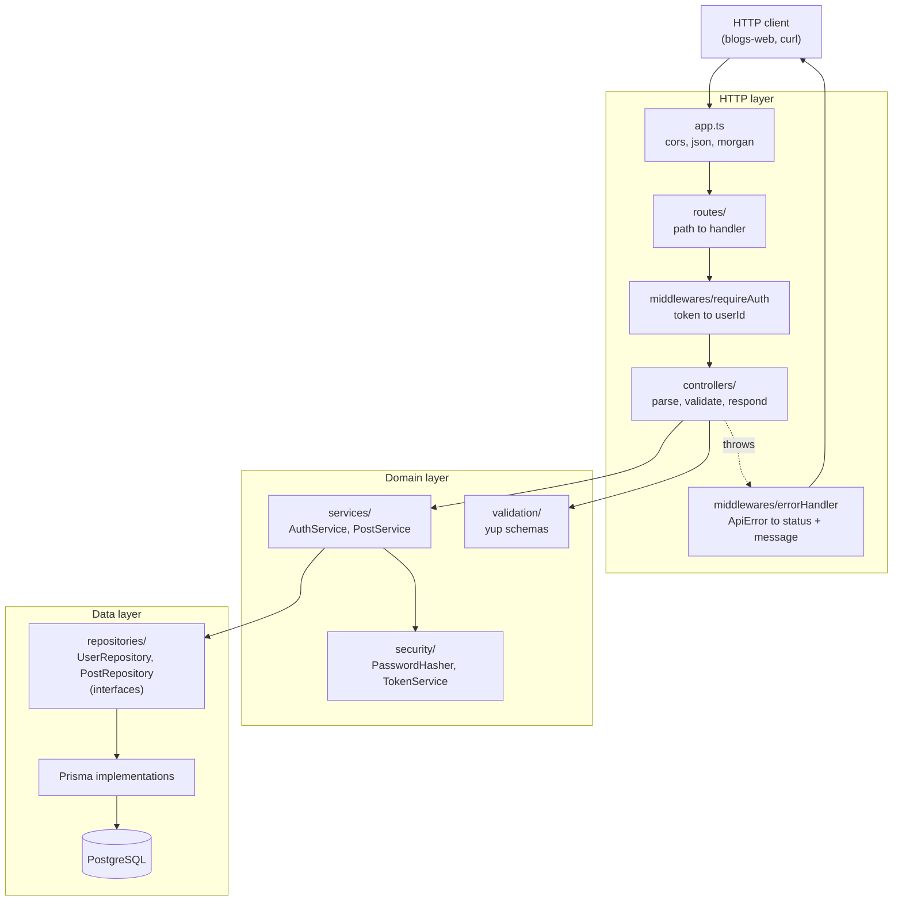
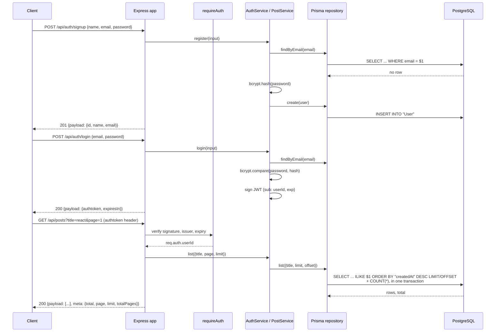

# blogs-server

A small REST API for a multi-user blog. Users sign up, log in for a bearer token, and then
create posts and read a paginated, searchable list of everyone's posts. It is the backend
half of a pair; [`blogs-web`](https://github.com/Chsaleem31/blogs-web) is the React client
that consumes it.

Node + TypeScript on Express 4, Prisma 5 against PostgreSQL, Mocha and Chai for tests.

## Captured output

There is no UI here — this is an API. The transcript below is a real session recorded
against a local server on port 8580 backed by a seeded Postgres 16 database. The full
recording, including error cases, is in [`docs/api-session.txt`](docs/api-session.txt).

```console
$ curl -s -i -X POST http://localhost:8580/api/auth/signup -H 'Content-Type: application/json' -d '{"name":"Ada Lovelace","email":"ada@example.com","password":"analytical1843"}' | sed -n '1p;/^{/p' | jq -R 'fromjson? // .'
"HTTP/1.1 201 Created\r"
{
  "payload": {
    "id": "949207c4-ee90-42ae-9821-a52d22bce88a",
    "name": "Ada Lovelace",
    "email": "ada@example.com"
  }
}

$ # the token's payload, decoded - it carries the user id and nothing else
$ node -e "console.log(Buffer.from(process.argv[1].split('.')[1],'base64url').toString())" "$TOKEN" | jq
{
  "iat": 1790300802,
  "exp": 1790304402,
  "iss": "blogs-server",
  "sub": "949207c4-ee90-42ae-9821-a52d22bce88a"
}

$ curl -s 'http://localhost:8580/api/posts?limit=3' -H "authtoken: $TOKEN" | jq '{payload: [.payload[] | {title, createdAt}], meta}'
{
  "payload": [
    {
      "title": "Notes on the Analytical Engine",
      "createdAt": "2026-09-25T01:46:43.154Z"
    },
    {
      "title": "Learn Nodejs",
      "createdAt": "2026-09-25T01:46:36.534Z"
    },
    {
      "title": "Introduction to JavaScript",
      "createdAt": "2026-09-25T01:46:36.534Z"
    }
  ],
  "meta": {
    "total": 10,
    "page": 1,
    "limit": 3,
    "totalPages": 4
  }
}

$ curl -s 'http://localhost:8580/api/posts?title=REACT' -H "Authorization: Bearer $TOKEN" | jq '{payload: [.payload[] | {title}], meta}'
{
  "payload": [
    {
      "title": "Mastering React"
    }
  ],
  "meta": {
    "total": 1,
    "page": 1,
    "limit": 20,
    "totalPages": 1
  }
}

$ curl -s -X POST http://localhost:8580/api/auth/login -H 'Content-Type: application/json' -d '{"email":' | jq
{
  "payload": {},
  "message": "Malformed JSON body"
}
```

The test suite output is recorded in [`docs/test-run.txt`](docs/test-run.txt):

```console
$ npm test
...
  56 passing (1s)
```

## Architecture

Layered, with dependencies pointing inward. An HTTP concern never reaches the services,
and a Prisma type never reaches a controller.



## Request flow

The main flow, from a cold client to a page of posts.



## Quickstart

Requires Node 18.17+ and a PostgreSQL 13+ database.

```bash
git clone https://github.com/Chsaleem31/blogs-server.git
cd blogs-server
npm install

cp .env.example .env          # then edit DATABASE_URL and JWT_KEY
npm run db:migrate            # create the tables and indexes
npm run db:seed               # optional: one user and nine posts
npm run dev                   # http://localhost:8080
```

The seeded user is `johndoe@example.com` / `abcd1234`.

With Docker instead, fill in `.env` (including `POSTGRES_PASSWORD`) and:

```bash
docker compose up --build     # API on http://localhost:8580
```

Compose starts Postgres, runs `prisma migrate deploy` as a one-shot job, then starts the
API once that job has succeeded.

### API surface

| Method | Path               | Auth | Purpose                                              |
| ------ | ------------------ | ---- | ---------------------------------------------------- |
| `GET`  | `/health`          | no   | Liveness probe, also used by the Docker healthcheck. |
| `POST` | `/api/auth/signup` | no   | Create a user. `201` with the public user.           |
| `POST` | `/api/auth/login`  | no   | Exchange credentials for an access token.            |
| `GET`  | `/api/posts`       | yes  | List posts. `?title=`, `?page=`, `?limit=`.          |
| `POST` | `/api/posts`       | yes  | Create a post attributed to the caller.              |

Send the token either as `authtoken: <token>` (what `blogs-web` uses) or as the standard
`Authorization: Bearer <token>`. Successful responses are `{ "payload": ... }`; list
responses add a sibling `"meta"`. Failures are `{ "payload": {}, "message": "..." }`.

## Configuration

| Variable             | Required | Default                                       | Purpose                                                                                           |
| -------------------- | -------- | --------------------------------------------- | ------------------------------------------------------------------------------------------------- |
| `DATABASE_URL`       | yes      | –                                             | Postgres connection string used by Prisma.                                                        |
| `JWT_KEY`            | yes      | –                                             | Secret used to sign access tokens. Must be ≥ 32 chars when `NODE_ENV=production`.                 |
| `PORT`               | no       | `8080`                                        | HTTP port.                                                                                        |
| `NODE_ENV`           | no       | `development`                                 | One of `development`, `test`, `production`. Gates request logging and the `JWT_KEY` length check. |
| `JWT_EXPIRES_IN`     | no       | `1h`                                          | Access token lifetime, in `ms`-package syntax.                                                    |
| `JWT_ISSUER`         | no       | `blogs-server`                                | `iss` claim, checked on verify.                                                                   |
| `CORS_ORIGINS`       | no       | `REACT_APP_URL`, else `http://localhost:3000` | Comma-separated browser origins allowed to call the API.                                          |
| `REACT_APP_URL`      | no       | –                                             | Deprecated name for `CORS_ORIGINS`, still honoured.                                               |
| `BCRYPT_ROUNDS`      | no       | `10`                                          | bcrypt cost factor.                                                                               |
| `PAGE_DEFAULT_LIMIT` | no       | `20`                                          | Page size when `?limit=` is absent.                                                               |
| `PAGE_MAX_LIMIT`     | no       | `100`                                         | Largest page a client may request; bigger values are rejected with `400`.                         |
| `TEST_DATABASE_URL`  | tests    | –                                             | Throwaway database for the integration suite. Its tables are truncated between tests.             |

Every variable is read once, in `src/config/env.ts`, and the process refuses to start if a
required one is missing. Nothing else in the codebase touches `process.env`.

## Development

```bash
npm run dev          # ts-node + nodemon
npm run build        # tsc -> dist/
npm start            # run the compiled output
npm run typecheck    # tsc --noEmit
npm run lint         # eslint
npm run format       # prettier --write
npm test             # full suite: needs TEST_DATABASE_URL
npm run test:unit    # unit tests only: needs no database
npm run benchmark    # see "Scalability" below; destructive, use a throwaway database
```

### Tests

The suite has two halves.

- **Unit tests** (`tests/unit/`) drive the services through in-memory implementations of
  the repository interfaces. No database, no network, milliseconds to run.
- **Integration tests** (`tests/integration/`) mount the real Express app with supertest
  and hit a real Postgres, so the Prisma queries, the middleware chain, validation and the
  error handler are all exercised end to end.

The integration half refuses to run unless `TEST_DATABASE_URL` is set, so a stray
`npm test` can never truncate a development database. Set it to something disposable:

```bash
createdb blogs_test
TEST_DATABASE_URL=postgresql://localhost:5432/blogs_test npm test
```

## Project structure

```
src/
  app.ts                 Builds the Express app from its dependencies. Binds no port.
  server.ts              Owns the process: listen, SIGTERM, graceful shutdown.
  config/env.ts          The only reader of process.env. Validates and freezes config.
  routes/                URL to handler. Factories, so dependencies are injected.
  middlewares/
    requireAuth.ts       Token -> req.auth.userId. Accepts authtoken or Bearer.
    asyncHandler.ts      Forwards rejected promises to the error handler.
    errorHandler.ts      ApiError -> status + message; anything else -> 500.
  controllers/           Parse and validate input, call a service, shape the response.
  services/              The business rules. No Express types, no Prisma types.
    container.ts         Production wiring, in one place.
  repositories/          Storage interfaces + their Prisma implementations.
  security/              PasswordHasher and TokenService interfaces + implementations.
  validation/            yup schemas and the validate() helper that turns failures into 400s.
  errors/apiError.ts     The error taxonomy the handler maps to status codes.
  http/response.ts       The { payload, meta } envelope.
  db/prisma.ts           One PrismaClient for the process.
prisma/
  schema.prisma          Models and indexes.
  migrations/            Applied with `prisma migrate deploy`.
  seed.ts, seedData.ts   Demo data.
tests/
  unit/                  Services against in-memory repositories.
  integration/           The real app against a real Postgres.
  helpers/               Test app, factories, database reset, in-memory repositories.
scripts/benchmark.ts     Reproduces the numbers in "Scalability".
docs/                    Captured API session, test run, benchmark output.
```

## Design notes

**Layering.** Controllers are HTTP adapters: they validate the request, call one service
method, and hand the result to the response helper. `AuthService` and `PostService` hold
the rules — that a duplicate email is a conflict, that a failed login must look identical
whether the user exists or not, that an author id comes from the token and never from the
body. Repositories own the SQL. The services depend on repository _interfaces_, not on
Prisma, which is why the unit tests can run the real services with no database at all.

**The seam that matters.** `UserRepository`, `PostRepository`, `PasswordHasher` and
`TokenService` are interfaces with one production implementation each and one test
implementation. That is the extension point a future developer would actually reach for:
moving posts to a different store, or replacing JWTs with server-side sessions, is a new
class and one line in `services/container.ts`. Everything above stays untouched.

**Tokens.** A JWT is signed, not encrypted — whoever holds one can read its payload. So
the payload carries the user id as `sub` and nothing else: no email, no name, and
certainly no password hash. Tokens expire (`JWT_EXPIRES_IN`, one hour by default) and
carry an `iss` claim that is checked on verification, so a token minted by another service
sharing the secret is still rejected.

**Login is not an enumeration oracle.** An unknown email and a wrong password return the
same `401` with the same message, and an unknown email still pays for a bcrypt comparison
against a dummy hash, so the two cases cost the same wall-clock time.

**Errors.** Every deliberate failure is an `ApiError` subclass carrying its status. One
Express error handler maps those to the response envelope and turns everything else into a
generic `500`, logging the real cause server-side. Handlers are wrapped in `asyncHandler`
because Express 4 does not catch rejected promises — an uncaught one leaves the request
hanging until the client gives up.

**Validation actually runs.** Input is validated _and the parsed result is what the
service sees_: unknown keys are stripped, strings are trimmed, emails are lower-cased,
query numbers are coerced. Validating one object and then reading another is a common way
for validation to become decorative.

## Scalability

The numbers below were measured on PostgreSQL 16.15 with 50,000 posts, using
`npm run benchmark`. Raw output, including the query plans, is in
[`docs/benchmarks/`](docs/benchmarks/).

**The real bottleneck was `GET /api/posts` returning the entire table.** It had no
`LIMIT`, so the response grew linearly with the database:

| Query                        | Before    | After    |
| ---------------------------- | --------- | -------- |
| List posts, wall clock       | 305.8 ms  | 3.8 ms   |
| List posts, JSON on the wire | 25.72 MiB | 10.0 KiB |

The fix is ordinary pagination — `?page=` and `?limit=`, a `PAGE_MAX_LIMIT` ceiling so a
client cannot ask for the table back, and a `meta` block carrying the total. The page and
its count are fetched in one `prisma.$transaction`, so a page costs one round trip.

**Second: the title search could not use an index.** `?title=` compiles to
`ILIKE '%term%'`, which no B-tree can serve, so every search was a sequential scan of the
whole table:

```
Seq Scan on "Post"  (actual time=0.004..19.643 rows=5000 loops=1)
  Filter: (title ~~* '%express%'::text)
  Rows Removed by Filter: 45000
Execution Time: 19.873 ms
```

Three indexes were added (`prisma/migrations/20260925013935_add_post_indexes`):

- `Post_createdAt_idx` on `createdAt DESC`, which serves the newest-first ordering.
- `Post_authorId_idx`, because Postgres does not index foreign keys automatically.
- `Post_title_idx`, a `pg_trgm` GIN index, which is what makes a leading-wildcard `ILIKE`
  indexable at all.

Being precise about which index did what: for a _page_ of search results the planner
prefers an ordered scan of `Post_createdAt_idx` with the `ILIKE` as a filter, and that
alone takes the search from **19.87 ms to 0.085 ms**. The trigram index earns its place on
the query that cannot ride the ordering — the `COUNT(*)` behind `meta.total`:

| `COUNT(*) WHERE title ILIKE …` | Without the trigram index | With it |
| ------------------------------ | ------------------------- | ------- |
| broad term (10% of rows match) | 26.11 ms                  | 5.56 ms |
| selective term (1 row matches) | 26.07 ms                  | 0.67 ms |

**Third: connection pools were being multiplied.** `new PrismaClient()` appeared in three
modules; each instance opens its own pool, so the process held three times the Postgres
connections it needed. There is now one client, in `src/db/prisma.ts`.

**Fourth: password hashing blocked the event loop.** Signup and login used
`bcrypt.hashSync` / `compareSync`, which occupy the single thread for the whole cost
factor. Both are now the async variants, which yield between rounds.

Deliberately _not_ done: no cache, no queue, no read replica, no Kubernetes. At this size
they would be decoration. The honest next step, if the post table grew past what
`OFFSET` handles well, is keyset pagination on `(createdAt, id)` — see Limitations.

## Limitations

- **Read-only after creation.** There is no update or delete for posts, no profile
  endpoint, no per-author filter, and no pagination cursor. The API is what the `blogs-web`
  client needs and no more.
- **Every authenticated user sees every post.** There is no ownership check anywhere
  because nothing is mutable after creation; the moment an edit or delete endpoint is
  added, one will be required.
- **Offset pagination.** `OFFSET n` makes Postgres walk and discard `n` rows, so deep pages
  get slower the further in they are. Fine for thousands of posts, wrong for millions;
  keyset pagination on `(createdAt, id)` is the replacement.
- **Search is substring matching, not full-text.** `ILIKE '%term%'` over titles only. It
  does not stem, rank, or look at post bodies. Postgres `tsvector` would, at the cost of a
  maintained column.
- **Tokens cannot be revoked.** A JWT is valid until it expires; there is no deny-list. The
  one-hour lifetime is the whole mitigation, and there is no refresh token, so clients
  re-authenticate every hour.
- **The index migration takes a write lock.** Prisma runs each migration in a transaction,
  so `CREATE INDEX` cannot be `CONCURRENTLY`. Against a large live table you would create
  the indexes by hand outside a transaction and mark the migration applied.
- **`CREATE EXTENSION pg_trgm` needs elevated privileges.** Managed Postgres services
  usually allow it, but the migration will fail for a role that cannot create extensions.
- **The integration tests need a real Postgres.** They are not mocked, on purpose — mocking
  Prisma would test the mock. The trade-off is that `npm test` needs a database;
  `npm run test:unit` is the half that does not.
- **No rate limiting.** `POST /api/auth/login` can be hammered. A reverse proxy or
  `express-rate-limit` belongs in front of it before this faces the internet.
