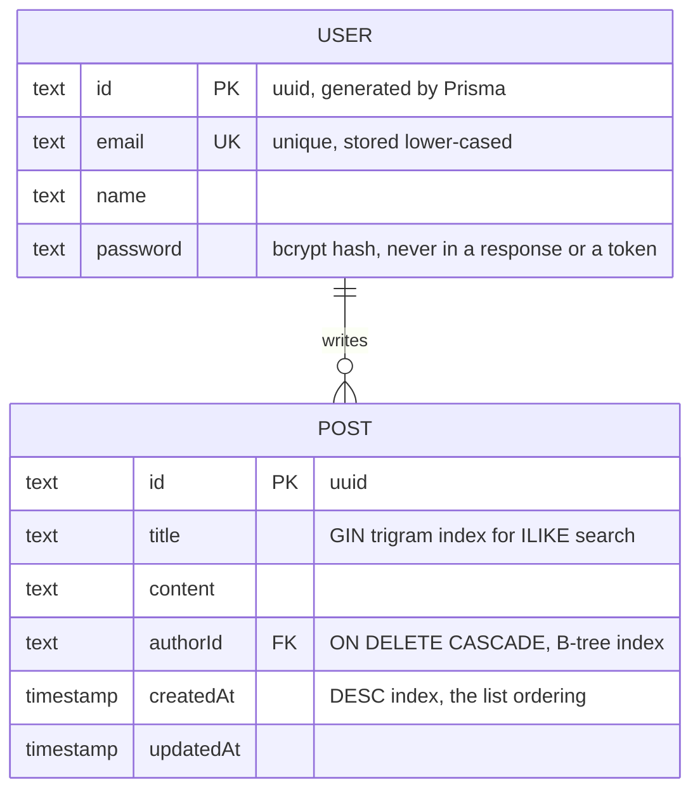
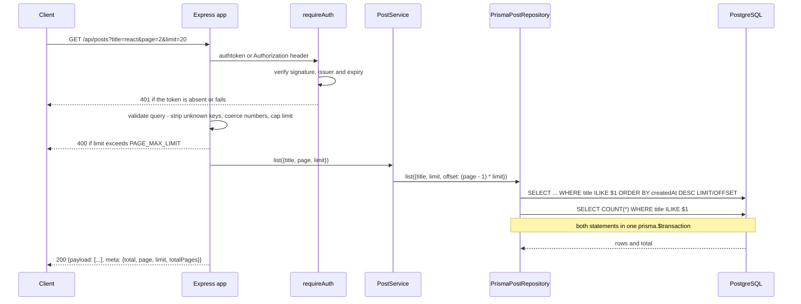

# blogs-server

A REST API for a small multi-user blog: sign up, log in for a token, publish a post, read a
paginated and title-searchable list of everyone's posts. Five endpoints, two tables, nothing else
— the backend half of a pair, with the React client
[`blogs-web`](https://github.com/TCMS31/blogs-web) in front. TypeScript on Express 4, Prisma 5
against PostgreSQL, Mocha and Chai, Node 18.17+.

## The two tables



Three things about `Post` are chosen, not defaulted, each matching a query the API runs.
`createdAt` is indexed **descending**, because newest-first is the only ordering on offer. `title`
carries a **`pg_trgm` GIN index**: search is `ILIKE '%term%'`, and a leading wildcard makes a
B-tree useless, so trigrams are what make it indexable at all. `authorId` is indexed by hand —
Postgres does not do that for you — and cascades, so deleting an author deletes their posts. All
three live in `prisma/migrations/20260925013935_add_post_indexes`; measured effect further down.

## What you can call

| Method | Path               | Auth | Result                                               |
| ------ | ------------------ | ---- | ---------------------------------------------------- |
| `GET`  | `/health`          | no   | `{status, uptime}`. Backs the container healthcheck. |
| `POST` | `/api/auth/signup` | no   | `201` with the public user — id, name, email.        |
| `POST` | `/api/auth/login`  | no   | `200` with `{authtoken, expiresIn}`.                 |
| `GET`  | `/api/posts`       | yes  | A page of posts. `?title=`, `?page=`, `?limit=`.     |
| `POST` | `/api/posts`       | yes  | `201` with the post, attributed to the caller.       |

Successes are `{ "payload": ... }`, with a sibling `"meta"` of `{total, page, limit, totalPages}`
on the list; failures are `{ "payload": {}, "message": "..." }`. The envelope never changes
shape, only its contents. A token goes in either an `authtoken` header or a standard
`Authorization: Bearer` one — `requireAuth` prefers `Bearer` and falls back to `authtoken`, the
header the original contract used. There is no update or delete: posts are append-only, which is
why no endpoint needs an ownership check.

**This agrees with `blogs-web`.** The client calls `/auth/login`, `/auth/signup` and `/posts`
under an `/api` base, reads `data.payload`, mirrors `meta` field-for-field in its own `PageMeta`
type, expects `{authtoken, expiresIn}` from login, sends `page`, `limit` and `title` as query
parameters, and sets both headers on every request. Its page size is 6 and always explicit.

## Serving one page of posts



The page and its total go out in **one** `prisma.$transaction`, so a page is one round trip and the
count cannot disagree with the rows. `PAGE_MAX_LIMIT` (100) means asking for 500 is a `400`, not a
way to request the whole table. `PostService` decides what a page is — offset from `page`,
`totalPages` from the count — while `PrismaPostRepository` only knows how to fetch one.

## Running it

Node 18.17+ and a PostgreSQL database. Password hashing is pure-JS `bcryptjs`, so there is no
native build step and no compiler toolchain to install.

```bash
npm install
cp .env.example .env          # then set DATABASE_URL and JWT_KEY
npm run db:migrate            # tables, indexes, pg_trgm
npm run db:seed               # optional: one user and nine posts
npm run dev                   # http://localhost:8080
```

The seeded login is `johndoe@example.com` / `abcd1234`.

There is also a `Dockerfile` (four stages, `node:20-alpine`, non-root, `dumb-init` so SIGTERM
reaches the graceful shutdown) and a `docker-compose.yml` that starts Postgres, migrates it in a
one-shot job, then serves the API on host port 8580. `JWT_KEY` and
`POSTGRES_PASSWORD` are `${VAR:?...}`, so compose refuses to start rather than invent a default
secret. **The image has not been built or booted in this environment — Docker is unavailable
here, so the compose path is written but unexercised.** The npm path above is what has been run.

## A session against a running server

No UI, so captured requests are the evidence.
[`docs/api-session.txt`](docs/api-session.txt) is a real session against a seeded Postgres 16
database: signup's `201` (id, name, email, no password field), the duplicate-email `409`, the
unauthenticated `401`, a case-insensitive `?title=REACT` search with its `meta`, the over-limit
`400`, the unknown-route `404` and a malformed body's `400`. The one worth reading first:

```console
$ # the token's payload, decoded - it carries the user id and nothing else
$ node -e "console.log(Buffer.from(process.argv[1].split('.')[1],'base64url').toString())" "$TOKEN" | jq
{
  "iat": 1790300802,
  "exp": 1790304402,
  "iss": "blogs-server",
  "sub": "949207c4-ee90-42ae-9821-a52d22bce88a"
}
```

## Environment variables

Read once, in `src/config/env.ts`, which throws at startup if a required one is missing. Nothing
else in the codebase touches `process.env`.

| Variable            | Required | Default                                       | Purpose                                                              |
| ------------------- | -------- | --------------------------------------------- | -------------------------------------------------------------------- |
| `DATABASE_URL`      | yes      | –                                             | Postgres connection string for Prisma.                               |
| `JWT_KEY`           | yes      | –                                             | Token signing secret. Must be ≥ 32 chars when `NODE_ENV=production`. |
| `NODE_ENV`          | no       | `development`                                 | Gates request logging and the `JWT_KEY` length check.                |
| `CORS_ORIGINS`      | no       | `REACT_APP_URL`, else `http://localhost:3000` | Comma-separated allowed browser origins.                             |
| `PAGE_MAX_LIMIT`    | no       | `100`                                         | Largest page a client may ask for. Bigger is a `400`.                |
| `TEST_DATABASE_URL` | tests    | –                                             | Throwaway database for the integration suite. Truncated each test.   |

`PORT` (`8080`), `JWT_EXPIRES_IN` (`1h`), `JWT_ISSUER` (`blogs-server`), `BCRYPT_ROUNDS` (`10`),
`PAGE_DEFAULT_LIMIT` (`20`) and the superseded `REACT_APP_URL` are the remaining knobs, all in
`.env.example` with a `crypto.randomBytes` recipe for a real secret.

## Two test suites, for two different reasons

```bash
npm run test:unit    # services against in-memory repositories. No database.
npm test             # the above plus integration. Needs TEST_DATABASE_URL.
npm run lint         # eslint
npm run typecheck    # tsc --noEmit
npm run build        # tsc -> dist/, then `npm start`
npm run benchmark    # the numbers below. Destructive: throwaway database only.
```

**56 tests, 23 unit and 33 integration.** The unit half drives `AuthService`, `PostService`,
`JwtTokenService` and `validate` through in-memory repositories — no database, no network, 92 ms.
The integration half mounts the real Express app under supertest against a real Postgres, so the
queries, middleware, validation and error handler are exercised together: the auth-failure matrix
(missing, wrong secret, wrong issuer, expired, no subject, garbage), a spoofed `authorId`,
ordering, three pages of pagination, the limit ceiling, search, and `400`/`413`.

```console
$ TEST_DATABASE_URL=postgresql://blogs@127.0.0.1:54329/blogs_test npm test
...
  56 passing (2s)
```

The integration half **refuses to run** unless `TEST_DATABASE_URL` is set, so a stray `npm test`
cannot truncate a development database. Full transcript: [`docs/test-run.txt`](docs/test-run.txt).

## Where the time goes at 50,000 posts

`npm run benchmark` (`scripts/benchmark.ts`) fills a throwaway database with synthetic posts and
times the two queries that grow with it. Raw output and `EXPLAIN (ANALYZE, BUFFERS)` plans are in
[`docs/benchmarks/`](docs/benchmarks/); every figure here is a median of seven runs on PostgreSQL
16.15 with 50,000 rows in `Post`.

**Paging is not a nicety.** On the same database in the same run, returning every row costs about
80× the wall clock and 2,600× the bytes of a page of 20 with its total:

| `GET /api/posts` over 50,000 posts | every row, no `LIMIT` | one page of 20 + total |
| ---------------------------------- | --------------------- | ---------------------- |
| wall clock                         | 298.9 ms              | 3.8 ms                 |
| serialised JSON                    | 25.72 MiB             | 10.0 KiB               |

**The search needs its index.** With only the primary key on `Post`, `ILIKE '%express%'` is a
sequential scan of the whole table:

```
Seq Scan on "Post"  (actual time=0.004..19.643 rows=5000 loops=1)
  Filter: (title ~~* '%express%'::text)
  Rows Removed by Filter: 45000
Execution Time: 19.873 ms
```

With the three indexes it becomes an ordered walk of `Post_createdAt_idx` with the `ILIKE` as a
filter, stopping after 20 rows: **19.87 ms → 0.09 ms** of Postgres execution time. Which index does
that is not what you would guess — the paged search rides `createdAt`, not the trigram index. The
trigram index earns its keep on the `COUNT(*)` behind `meta.total`, which cannot ride the ordering:
with `enable_bitmapscan` toggled it takes a broad term from **26.11 ms to 5.56 ms** and a selective
one from **26.07 ms to 0.67 ms** (`docs/benchmarks/trigram-index.txt`). Deliberately absent: cache,
queue, read replica, Kubernetes. The honest next step is keyset pagination — first item below.

## Known gaps

- **Offset pagination.** `OFFSET n` makes Postgres walk and discard `n` rows, so deep pages get
  slower the further in they go. Fine for thousands of posts, wrong for millions; keyset
  pagination on `(createdAt, id)` is the replacement.
- **Substring search, not full-text.** `ILIKE '%term%'` over titles only — no stemming, no ranking,
  no post bodies. A `tsvector` column would fix all three, at the cost of upkeep.
- **Tokens cannot be revoked.** No deny-list, no refresh token. The one-hour default lifetime is
  the whole mitigation.
- **No rate limiting.** `POST /api/auth/login` can be hammered. That belongs in a reverse proxy,
  not in the app.
- **The index migration takes a write lock, and needs privileges.** Prisma runs each migration in
  a transaction, so `CREATE INDEX` cannot be `CONCURRENTLY` — against a large live table you would
  create the indexes by hand and mark the migration applied. `CREATE EXTENSION pg_trgm` will also
  fail for a role that cannot create extensions.
- **No edit, delete, profile, or per-author filter.** The API is what `blogs-web` needs. The moment
  an edit or delete endpoint appears it will need the ownership check nothing currently requires.

## Decisions a reviewer might ask about

**Why four interfaces for a five-endpoint API.** `UserRepository`, `PostRepository`,
`PasswordHasher` and `TokenService` each have one production and one test implementation. Not
speculative layering: it is what makes `npm run test:unit` possible with no Postgres, and swapping
the store or replacing JWTs with sessions is a new class plus one line in `services/container.ts`.
Dependencies point inward — no Prisma type reaches a controller.

**The token carries the user id and nothing else.** A JWT is signed, not encrypted, so anything
in its payload is readable by whoever holds it. The payload is exactly `{sub, iat, exp, iss}` — a
unit test asserts `Object.keys(payload).sort()` and that the serialised payload contains neither
the email, the name, nor a `$2a$`/`$2b$` prefix. `iss` is checked on verify, so a token minted by
another service sharing the secret is still rejected.

**Login is not an enumeration oracle.** An unknown email and a wrong password return the same
`401` with the same message, and an unknown email still pays for a bcrypt comparison against a
fixed dummy hash (`verifyAgainstOptionalHash`), so both cost the same wall-clock time.

**Validation is not decorative, and errors are a taxonomy.** The parsed value is what the service
sees, never the raw body — unknown keys stripped, emails lower-cased, numbers coerced, so a client
that posts its own `authorId` has it dropped (a test tries). Every deliberate failure is an
`ApiError` subclass carrying its status, body-parser's own `400` and `413` pass through rather than
being flattened, and anything unrecognised is logged in full and reported as a generic `500`.
Handlers are wrapped in `asyncHandler` because Express 4 does not catch rejected promises.
